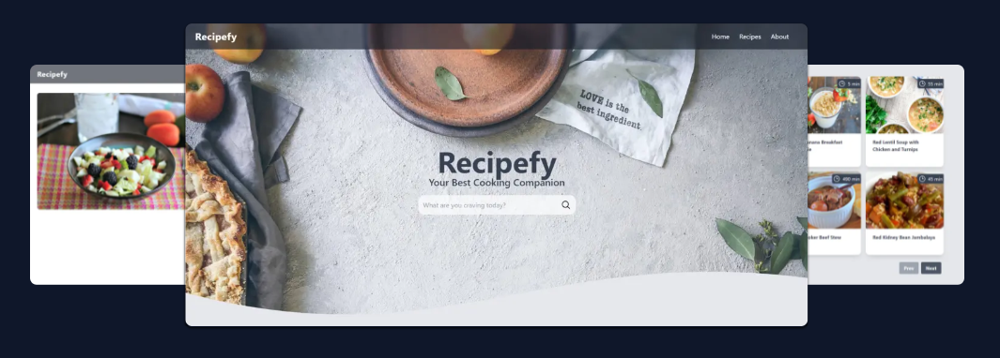

# Recipefy

Recipefy is a web application that allows users to search for recipes based on keywords, meal types, or ingredients. It utilizes the Spoonacular API to provide a list of recipes with details such as recipe name, preparation time, and cooking instructions. Users can also filter recipes by meal type.

## Technologies

Recipefy is built with the following technologies:

- [ReactJS](https://reactjs.org/)
- [TailwindCSS](https://tailwindcss.com/)
- [React Query](https://react-query.tanstack.com/)
- [React Router](https://reactrouter.com/)

For detailed information on these technologies, please refer to their respective documentation.

## API

The recipe data is sourced from the [Spoonacular API](https://spoonacular.com/food-api). Please refer to their documentation for more information on how to use the API.

## Features

- Users can search for recipes based on keywords, meal types, or ingredients.
- Users can filter food recipes by meal type.
- The application provides a list of recipes with details such as recipe name, preparation time, and cooking instructions.


## Installation

To use this application, you will need [Node.js](https://nodejs.org/) installed on your computer.

1. Clone the repository:
```bash
git clone https://github.com/pusakamanggala/cook-recipe-web-app.git
cd cook-recipe-web-app
```

2. Install the dependencies:
```bash
npm install
```
3. Start the development server:
```bash
npm start
```
This will start the development server and open the application in your default browser
